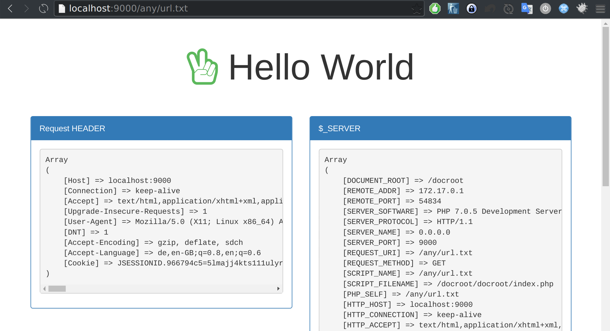

# Hello World Container

Simple Hello World Container

* Outputs Headers, $_SERVER, $_GET, $_POST for every request
* Based on php:7-alpine



### Usage
```
docker run -p 0.0.0.0:9000:9000 psi-4ward/hello-world
```
